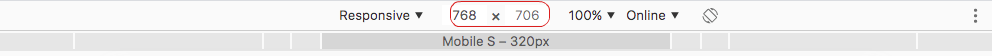

# 1 - Semantic HTML and CSS

### What are Chrome Developer Tools?

Here’s what you’ll see when you open Developer Tools:

.png>)

A standard web page, but with a new set of tools open in a panel on the right of the page.

There are three tabs at the top of the Developer Tools window, and a further six that you can see by clicking the **>>** symbol next to them.

The tabs are:

* Elements
* Console
* Source
* Network
* Application
* Security
* Memory
* Performance
* Audits

They don’t always stay in this order—Chrome moves them around based on which you opened last.

By default, Developer Tools opens with the Elements tab open.

**Elements** shows you the HTML used to build the page you’re looking at, together with any inline CSS.

.png>)

**Console** deals with JavaScript. It gives you information about interactive elements on a page. In Console, you can write JavaScript to interact with the web page you’re viewing, and it also lets you write messages to yourself in the JavaScript of websites you’re building, which then show up in Console to show that the JS was executed.

.png>)

The **Sources** tab shows you where all the files that were used to make the website are stored and lets you inspect them.

.png>)

The **Network** tab shows you all the files that are loading in the URL you’re looking at.

.png>)

You get a waterfall and deep data on all the items loaded, including initiator and time to load that element.

**Application** shows you what’s in your browser storage: in-browser databases like Web SQL, local storage, and more. It also gives you granular control over your cookies.

.png>)

### How to open Chrome Developer Tools

You can open Developer Tools with keyboard shortcuts or through the Chrome menu.

The keyboard shortcuts are:

* Mac OS: **CMD+Shift+J** or **CMD+Shift+C**
* Linux, Chromebook and Windows: **Ctrl+Shift+J**

From the Chrome menu:

Open the Chrome menu and go to “More Tools” > “Developer Tools.”\


.png>)

Finally, you can right-click (Windows) or Ctrl-click (Mac) anything on a web page and select “Inspect Element” to open Developer Tools.

The Developer Tools panel will open in whatever web page you’re on. You need to open them again for each new Chrome window, but you can navigate between web pages with them open.

### 5 common uses of Chrome Developer Tools for beginners

Just because you’re not a developer doesn’t mean Developer Tools aren’t for you. Here are five ways you can make your life easier with Developer Tools.

Most of these will use the Elements tab. Here’s a quick guide to that:

.png>)

The top section shows the HTML for the site.

The bottom left section shows the CSS styles applied to that page.

The bottom right shows the CSS layout visually so you know what you’re looking at.

#### 1. Inspect page tags

One of the most important elements of on page SEO is simple h1 and h2 tags. Snoop under the hood and you’ll find a lot of folks (including those who should know better) aren’t getting this stuff right.

Once you’ve seen pages where the h1 was an unoptimized image, or pages with four h1 tags, you begin to appreciate the urgency of the situation. And tools like Screaming Frog are great but they’re not always 100% accurate. It’s best to check by hand. It’s also very easy.

Open a page, then open Developer Tools. In the Elements tab, press **CMD+F** or **Ctrl-F** to search and search “h1” to see your page’s tag(s):

.png>)

#### 2. Edit CSS

Developer Tools lets you change the CSS of a page directly in your browser. You can trial color combinations, fonts—anything that’s governed by CSS. You don’t have to mess around with the stylesheet and you often don’t have to write a single character of code.

Suppose I want to see what the FYI homepage would look like with red text.

I open the page, then open Developer Tools. Ctrl-click or right-click the element you want to change on the web page. In the Elements tab I find the color for the element in the bottom left panel:

.png>)

Click on the color box and I can simply click on another color in Chrome Color Picker (more on this later). The text changes immediately.

.png>)

Probably going to leave that black.

#### 3. See what they built the website with

When you visit a website, it’s not always easy to see what CMS was used to build it. But you can find out easily with Developer Tools.

Open the site and Developer Tools, then look at the top right of the Styles panel in the Elements tab:

.png>)

Right-click or Ctrl-click on the link that starts “style.css” and select “Copy link address.” Paste the link into a new tab and it will tell you the CDN and theme used to build the site—in this case, it’s built using Divi on WordPress.

#### 4. Write into the website

If you’re working up copy for a new web page, you can go to one that already exists and write directly into it with Developer Tools. So if layout or sizing is an issue, you can check your copy still looks good in the environment it’s going to be displayed.

Here’s how.

Open Developer Tools on a web page—you can do this with any web page.

With the Elements tab open, right-click a piece of text on the page. You’ll see the relevant HTML highlighted:

.png>)

Find the three vertical dots on the left side of the HTML for that element, click them, and select “Edit as HTML.”

Even if you don’t know HTML from the DMV, you can still do this: all you’re looking for is the text you clicked on, inside all the code. The HTML is all color-coded, while the text is black. Click on it, and you can type in whatever you like:

.png>)

Click on the background to exit the HTML and your changes appear in the page itself:

.png>)

Yes, it looked better before. But this way you can find out for sure, and tailor your copy precisely to the layout and design it will be used with.

#### 5. See it on mobile

…and on any other viewport you want. Developer Tools lets you manage viewport appearance using both preselected sizes and free scaling.

Open Developer Tools and look at the top menu bar, where Elements, Console, and Source are displayed. You’ll see two icons on the far left of that bar; the one that looks like a stack of mobile devices is what we’re after.

.png>)

Click that and you’ll see the site you’re on displayed as if you were a mobile visitor:

.png>)

That’s cool, but there’s more you can do with these controls. The icon lets you toggle between mobile and desktop versions of the site. And the controls at the top of the screen let you adjust viewport size. Here’s how it looks on a mobile with a big screen:

.png>)

Here’s how it looks on a tablet:

.png>)

Use these controls to choose the viewport size you want:

.png>)

Use this dropdown to see what the site looks like on different devices:

.png>)

Set viewport size yourself:



And even mimic different connection qualities as you navigate the site:

.png>)

You can do all that and more from the menu bar at the top.


### HTML Syntax <a href="#html-syntax" id="html-syntax"></a>

You're already familiar with HTML code from your application process. If you want to refresh your memory, read this [quick guide to the HTML syntax](http://marksheet.io/html-syntax.html).

#### Exercise (1 minute) <a href="#exercise-1-minute" id="exercise-1-minute"></a>

All together, let's review the basic syntax in the following example:

```
<article>
  <h1>Learning HTML</h1>
  <p>Get to know the HTML basics.</p>
  <a href="http://html5rocks.com">Read Article</a>
</article>
```

Which parts are the **Tags** and which parts are the **Attributes**.


### HTML Tags <a href="#html-tags" id="html-tags"></a>

HTML tags are arranged in a hierarchy. This is sometimes called "nesting" tags or creating an HTML "tree". Between the opening `<article>` tag and the closing `</article>` tag there are three other tags. We call these "child" tags, because they have a parent-child relationship.

.png>)

#### Exercise (5 minutes) <a href="#exercise-5-minutes" id="exercise-5-minutes"></a>

As a group, let's try to name all of the parent and child tags in the following example.

```
<article>
  <h1>Learning HTML</h1>
  <p>
    <span class="author">Author:</span>
    <a href="http://codeyourfuture.io">Code Your Future</a>
  </p>
  <p>Get to know the HTML basics.</p>
  <a href="http://html5rocks.com">Read Article</a>
</article>
```

### &#x20;<a href="#example-htmlcss-project" id="example-htmlcss-project"></a>

### Example HTML/CSS Project <a href="#example-htmlcss-project" id="example-htmlcss-project"></a>

In today's class, we will begin adapting styles on this example website. We'll review some of the HTML/CSS basics you already encountered during your application process and learn some new techniques. By the end of the third lesson, we will have worked together to improve the example site on the left so that it looks like the screenshot on the right.

Next image shows how it is right now:

.png>)

And this image shows how should be after you complete it:

.png>)

The example website you'll begin working with is available on this Code Your Future GitHub repository - [Bikes for Refugees](https://github.com/CodeYourFuture/bikes-for-refugees). Fork the repository to your personal account and then clone the repository

#### Exercise (5 minutes) <a href="#exercise-5-minutes" id="exercise-5-minutes"></a>

Spend a few minutes exploring the `.html` and `.css` files for this page. Why don't we put everything in one file?

### &#x20;<a href="#semantic-html" id="semantic-html"></a>

### Semantic HTML <a href="#semantic-html" id="semantic-html"></a>

When writing HTML code, you can use different tags to describe the content. Is it a navigation menu, a paragraph of text, or an article? By using the correct tag, you help search engines like Google or screen readers for the visually impaired.

> Semantic HTML is the use of HTML markup to reinforce the semantics, or **meaning**, of the information in webpages and web applications rather than merely to define its presentation or look. [Wikipedia](https://en.wikipedia.org/wiki/Semantic\_HTML)

We'll cover the following semantic tags:

* `<header>`
* `<footer>`
* The `role="main"` attribute
* `<nav>`
* `<article>`
* `<aside role="complementary">`

#### Exercise (10 minutes) <a href="#exercise-10-minutes" id="exercise-10-minutes"></a>

Determine where to place these new Tags and Attributes in the index.html file. Who benefits when we write "semantic" HTML?

### &#x20;<a href="#css-selectors" id="css-selectors"></a>

### CSS Cascading Style Sheet <a href="#css-selectors" id="css-selectors"></a>

Cascading style sheets (CSS) are an extension to HTML that allow you to specify formatting for an HTML document. Cascading style sheets are called _cascading_ because several different style sheets can be active for a single document at the same time.

For example, one style sheet may be associated with the document itself, another style sheet may be linked to the first one, and yet another may be associated with the web browser on which the document is being displayed. When multiple style sheets are in effect, they are applied to the document in a pre-determined sequence set by the browser: their formatting instructions can be thought of as cascading from one style sheet to the next.

It is important in which order you write your styles since new additions to your stylesheet might override previously written styles. However there is another concept we need to understand before moving forward.

#### Calculating CSS Specificity Value <a href="#h-calculating-css-specificity-value" id="h-calculating-css-specificity-value"></a>

If there are two or more conflicting CSS rules that point to the same element, the browser follows some rules to determine which one is most specific and therefore wins out.

Think of specificity as a score/rank that determines which style declarations are ultimately applied to an element.

CSS applies vastly different specificity weights to classes and IDs. In fact, an ID has _infinitely_ more specificity value! That is, no amount of classes alone can outweigh an ID.

Let’s take a look at how the numbers are actually calculated:

.png>)

In other words:

* If the element has inline styling, that automatically wins (1,0,0,0 points)
* For each ID value, apply 0,1,0,0 points
* For each class value (or pseudo-class or attribute selector), apply 0,0,1,0 points
* For each element reference, apply 0,0,0,1 point

You can generally read the values as if they were just a number, like 1,0,0,0 is “1000”, and so clearly wins over a specificity of 0,1,0,0 or “100”. The commas are there to remind us that this isn’t really a “base 10” system, in that you could technically have a specificity value of like 0,1,13,4 – and that “13” doesn’t spill over like a base 10 system would.

```
/* Basic specificity cheatsheet  */

h1 {
  /* Native elements have a weight of 0001. */
}

::after {
  /* Pseudo-elements have a weight of 0001. */
}

.class {
  /* Class selectors have a weight of 0010. */
}

[type="text"] {
  /* Attributes selectors have a weight of 0010. */
}

a:hover {
  /* Pseudo-classes have a weight of 0010. */
}

#id {
  /* Id's have a weight of 0100. */
}

/* Inline styles have a weight of 1000. */
<div style="color: red;">Text</div>

h1 {
  /* !imporant has a weight of 10000. */
  color: red !imporant; 
}
```

### &#x20;<a href="#css-selectors" id="css-selectors"></a>

### CSS Selectors <a href="#css-selectors" id="css-selectors"></a>

During your application process, you became familiar with CSS selectors. We'll review the basic selectors and then practice combining these to modify our button styles.

> If you want to review the selectors, read the [Common Selectors section](http://learn.shayhowe.com/advanced-html-css/complex-selectors/) of this page.

#### Exercise (10 minutes) <a href="#exercise-10-minutes" id="exercise-10-minutes"></a>

Make the blue buttons on the page red (`#ce5f31`). The white button, which says "Volunteer", should remain white but the text should change to red.

### Pseudo Classes <a href="#pseudo-classes" id="pseudo-classes"></a>

You can assign CSS rules to a class like this:

```
.btn {
  background: #ce5f31;
}
```

There are also things called "pseudo" classes. In this section, we'll introduce you to the common pseudo classes for assigning styles to interactions, such as moving your mouse over a link.

> "pseudo" is a fancy word for "fake". We call them "pseudo" classes because they're not really there in the HTML, but the browser knows what to do with them.

Here's an example of a pseudo class which changes the color of a link when the mouse moves over it.

```
.btn:hover {
  background: #ef7f52;
}
```

Not everyone uses a mouse. Some users will prefer a keyboard, where they can hit `tab` to move between links on a page. So that they can see where they are, you should add effects to the `:focus` pseudo class too.

```
.btn:hover,
.btn:focus {
  background: #ef7f52;
}
```

#### Exercise (10 minutes) <a href="#exercise-10-minutes" id="exercise-10-minutes"></a>

Work in pairs and use the pseudo classes to make the background color of the red buttons change when in a "hover" or "focus" state. See if you can make the white "Volunteer" button change to a different background without effecting the red buttons.


### Box Model <a href="#box-model" id="box-model"></a>

The CSS Box Model is used to create a definition for the way the HTML elements are organized on the screen. This approach accounts for options such as margins, padding, borders, and all the properties that manipulate them.&#x20;

Each element can be thought of as having its own box. As all the elements on a page have to work together with each other, it is quite important to know just how each of those boxes works. This brief tutorial will help explain the box model for beginners.

The CSS Box Model is a term used for the container that wraps the following element properties within it.

* **Margin**
* **Border**
* **Padding**
* **Content**
* **Height and Width**

However, understanding the term “Box Model” makes more sense once it is visually displayed. See the example image below for a more straight breakdown of where these bullet points relate to your HTML content.

.png>)

As you can see from the image above, the content sits inside the box model. In this case, you have an example “p,” (or paragraph) element on display with the simple text “Introduction to CSS Box Model” shown.  In the next few sections, each of these areas will be explained.

#### **The Margin**

On the CSS Box Model, the margin is the section in the exterior. This edge extends around the box model taking the empty space between the margin and border properties. You can consider this a buffer area that separates the interior of the CSS box model from other HTML elements on a page.&#x20;

Note that the margin is defined by **both** the width and height of the box, as well as set margin properties. This can also be affected by the “box-sizing” property.&#x20;

#### **The Border**

Next, you have the Border property of the CSS Box Model. Keeping in the theme of separation, this area exists as a boundary between the margin and padding properties of the box. This area can be manipulated using the CSS Border property for styling and sizing needs.

#### **The Padding**

The padding section of the CSS Box Model sits in the space between the HTML content and the border. As with much of the other items in the box model, the padding can be altered through its related properties. For example, the padding can be changed through the directions of the top, right, bottom, and left sections.

For example, we can take this sample CSS code below;

```
div {
  border-style: solid;
  border-color: blue;
  }
```

This div does not have padding defined, as such, you have the output shown in the image below.

.png>)

Now, the same code is used but a padding value of 40 pixels has been added.

```
div {
padding: 40px;
border-style: solid;
border-color: blue;
  }
```

This will now alter the padding to give you the following image.

.png>)

It’s easy to see that the added padding between the div content and the border has changed considerably.&#x20;

#### **The Content**

The Content is the center of the “tootsie pop,” so to say. This is the main HTML content you are working to display on the site. This can range from an image, a paragraph, or even a web button. While this is quite direct in definition, it should be noted that “content” can be empty space as well. Using an empty div for example can be a neat way to add extra creative components to a site design.

#### **The Height and Width**

The properties for height and width on the box model are set through the calculations of the applied contents. However, these can also be specified directly as needed to fit the page design.&#x20;

One common issue that beginners may encounter is forgetting to note the **height and width also takes into account the added padding or border values**. Quite simply, when you add padding or border changes, this will directly affect the visual width/height display for an element on the page.

Generally, the understood calculations are as follows:

**Box Width:**

padding **+** width **+** border **=** final width for the box model.&#x20;

**Box Height:**

padding **+** height **+** border **=** final height for the box model &#x20;

### **Changing the Box**

Sometimes, it just helps to see changes in action when it comes to this kind of information. For the next few examples, you can see just how much of an impact even a few slight changes to the box model within CSS can make.

#### **Margin Changes**

With this example, you can see how content can be displayed with multiple box models in use. Here, multiple divs have been used to display three separate contents sets. Each one is using the box model with various changes made to the borders to better identify each.&#x20;

Using this example code, three separate boxes will be created.

```
#div1 {
 padding: 40px;
 border-style: solid;
 border-color: blue;
  }

  #div2 {
 padding: 40px;
 border-style: dashed;
 border-color: red;
  }

  #div3 {
 padding: 40px;
 border-style: dotted;
 border-color: black;
  }
```

This provides this simple output shown in the image below.&#x20;

.png>)

Now, with some modifications made to the code, we alter how the content is presented in the box model structure. Going back to the use of margins mentioned above, the code below will add **margin** properties to the divs. Notice how each increases in each div.

```
#div1 {
 padding: 25px;
 border-style: solid;
 border-color: blue;
 margin: 10px;
  }

  #div2 {
 padding: 50px;
 border-style: dashed;
 border-color: red;
 margin: 30px;
  }

  #div3 {
 padding: 100px;
 border-style: dotted;
 border-color: black;
 margin: 50px;
  }
```

This margin increase can be seen in the spacing provided within the image below.

.png>)

With just a few margin adjustments, there is a great effect in both readability and design change for each box.&#x20;

#### **Width and Height Changes: Using the Box-Sizing Property**

Changing the width and height of an element can lead to some odd outcomes when the calculations for the additional constraints of the box model are not planned for. While setting those details and dimensions manually can be a valid need, sometimes it can also be worthwhile to use something more “automatic” in a sense.

This is where you can look at the use of the “**box-sizing**” property. The box-sizing property can take the values of “content-box” or “border-box”. These are explained below.

**Content-Box:**

With the property value set to “content-box”, the applied CSS values are used without regard to the margin, padding, or border settings. This takes the provided width and height for the content to be the only factors for the calculation. &#x20;

**Border-Box:**

The value of “border-box” creates a calculation where the values of the padding and border are inserted for height and width. The margin, however, is not included with this calculation which leads to it being rendered within the constraints of the box itself. This is important to note as the HTML content will be provided less area as some of it is taken over by the margin.

**Using Box-Sizing Example**

Take the example CSS code below for reference on using both of these options. For the first div, the “content-box” value was set for the “box-sizing” property. In the second example, the “border-box” property was used instead.&#x20;

**Note that both divs have the same padding, margin, width, and height values applied.** &#x20;

```
#div1 {
 padding: 15px;
 border-style: solid;
 border-color: blue;
 margin: 20px;
 width: 100px;
 height: 100px;
 box-sizing: content-box;
  }

  #div2 {
 padding: 15px;
 border-style: solid;
 border-color: red;
 margin: 20px;
 width: 100px;
 height: 100px;
 box-sizing: border-box;
  }
```

This example CSS code will provide the following box model examples as shown in the image below.

.png>)

As you can see, the method you choose can make drastic changes to the HTML content and how it is rendered to the page. A bit of trial and error can be expected and should be experienced to get a solid footing on your design concepts.&#x20;

#### &#x20;<a href="#exercise-10-minutes" id="exercise-10-minutes"></a>

#### Exercise (10 minutes) <a href="#exercise-10-minutes" id="exercise-10-minutes"></a>

Work in pairs and use the `margin` and `padding` rules to spread your navigation links out a bit wider. There should be a small gap between them and enough padding so that the border is not too tight on the text.

#### Exercise (10 minutes) <a href="#exercise-10-minutes" id="exercise-10-minutes"></a>

Use a transparent border so that the width of each navigation menu item stays the same even when it is hovered or focused.

**Note -** You may have noticed that the border you added to the navigation links causes the links to jump around when you move your mouse over them. That's because the border is adding to the width of the box model, pushing the others to the side.

You can also set a transparent border, so that it takes up the space without showing a visible border.

```
.navlink {
  border: 1px solid transparent;
}
```

#### &#x20;<a href="#exercise-10-minutes" id="exercise-10-minutes"></a>

### CSS Project (60 minutes+) <a href="#css-project-60-minutes" id="css-project-60-minutes"></a>

1. In this repository you will find a CSS Project for you to complete using what you've learnt so far today. Fork it [Zoo project repository](https://github.com/CodeYourFuture/HTML-CSS-Challenges) to your GitHub account.
2. Clone it to your computer and complete all the mistakes in the project and fix them by following these instructions [Zoo Project Readme](https://github.com/CodeYourFuture/HTML-CSS-Challenges/tree/main/zoo-css-challenge)


### Resources

1. [HTML5 - MDN](https://developer.mozilla.org/en-US/docs/Learn/HTML/Introduction\_to\_HTML/Getting\_started)
2. [CSS Selectors - MDN](https://developer.mozilla.org/en-US/docs/Web/CSS/CSS\_Selectors)
3. [The Cascade - MDN](https://developer.mozilla.org/en-US/docs/Web/CSS/Cascade)
4. [Box Model - MDN](https://developer.mozilla.org/en-US/docs/Learn/CSS/Introduction\_to\_CSS/Box\_model)
5. [CSS specificity - MDN](https://developer.mozilla.org/en/docs/Web/CSS/Specificity)
6. [Pseudo classes - MDN](https://developer.mozilla.org/en-US/docs/Web/CSS/Pseudo-classes)
