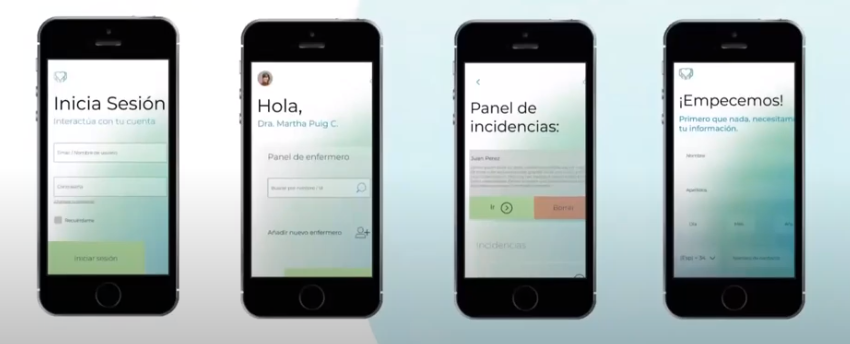
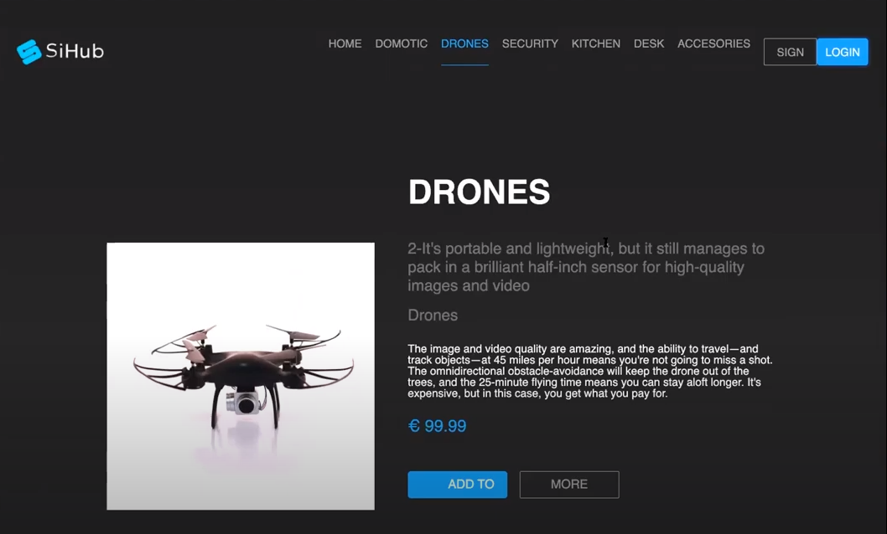
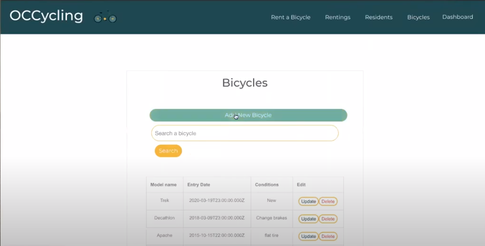
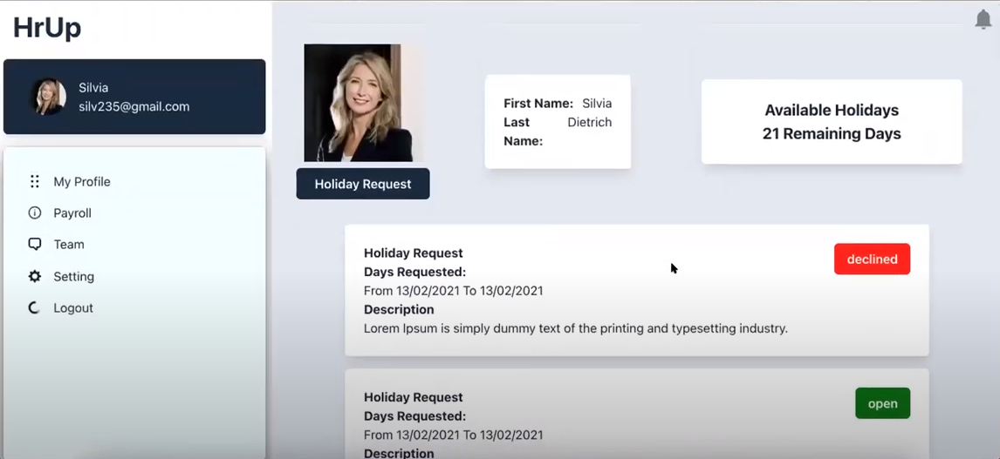
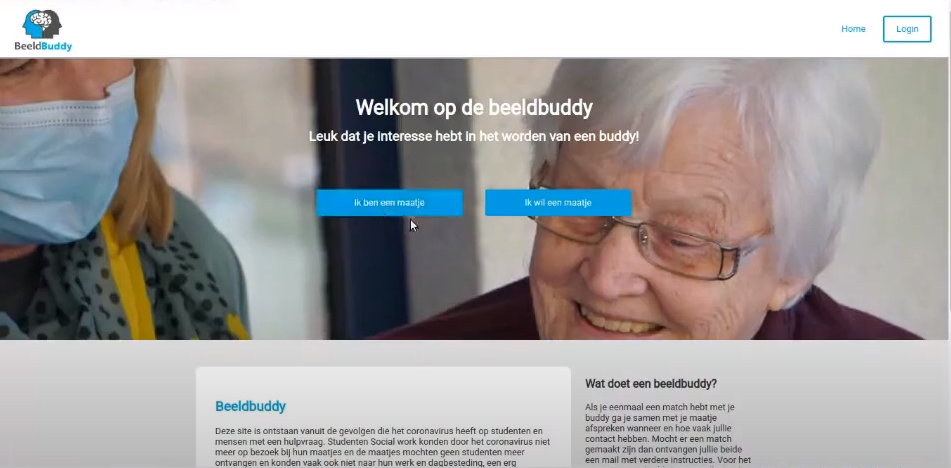
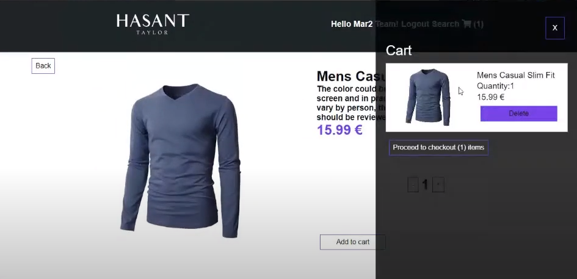
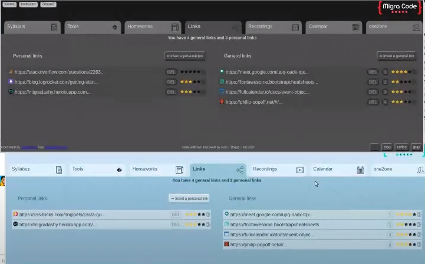
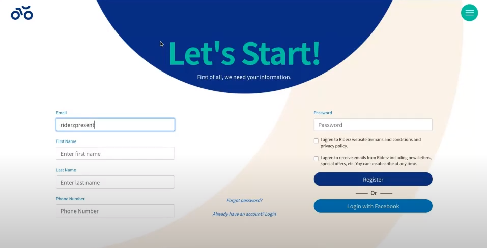
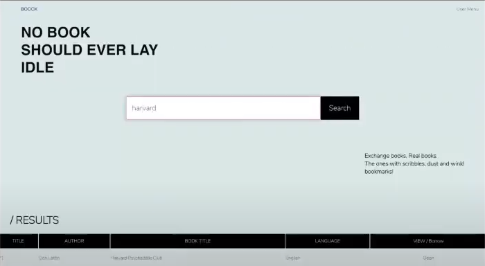

# List of projects

## 2022-Jan

### Team 1 - Rutas de Ciclismo&#x20;

| Title        |                                                                                                                Rutas de ciclismo                                                                                                                |
| ------------ | :---------------------------------------------------------------------------------------------------------------------------------------------------------------------------------------------------------------------------------------------: |
| Description  | A website where cyclist can upload a route, and include a description, pictures, useful information, safety info and more, and other cyclist can then view these routes and download the GPX files or save the description etc. as a PDF maybe. |
| Students     |                                                                                                    Valeria, Laeken, Diego (TL), Damian, Akram                                                                                                   |
| Instructor   |                                                                                                                Alejandro Sanchez                                                                                                                |
| Deliverables |                                                                                   Project Idea, Product Presentation, Trello Board, Github, Final presentation                                                                                  |
| Language     |                                                                                                                     Spanish                                                                                                                     |

### Team 2 - Migrant solidarity network

| Title        |                                                              Migrant Solidarity Network                                                             |
| ------------ | :-------------------------------------------------------------------------------------------------------------------------------------------------: |
| Description  | A website based on Barcelona, that collect all the information migrants need (about legal stuff, health, social events, courses etc.) in one place. |
| Students     |                                                    Burcak (TL), Juan, Mehtap, Kostiantyn, Rachid                                                    |
| Instructor   |                                                                  Raül Fornell Gómez                                                                 |
| Deliverables |                                     Project Idea, Product Presentation, Trello Board, Github, Final presentation                                    |
| Language     |                                                                       English                                                                       |

### Team 3 - NeedIt?

| Title        |                                                                                                             NeedIt?                                                                                                             |
| ------------ | :-----------------------------------------------------------------------------------------------------------------------------------------------------------------------------------------------------------------------------: |
| Description  | Recycling is really important this days, too many things are thrown away, PCs, washing machine, a table, baby clothes, toys, dishes or even a small spoon, the idea of the app is to use that and give it to those who need it. |
| Students     |                                                                                     Angel (TL), Daniel, Asaad, Matthew, Shaminderjeet, Fatma                                                                                    |
| Instructor   |                                                                                                            Diego Ruiz                                                                                                           |
| Deliverables |                                                                           Project Idea, Product Presentation, Trello Board, Github, Final presentation                                                                          |
| Language     |                                                                                                             English                                                                                                             |

### Team 4 - HireMigrants

| Title        |                                                                                     HireMigrants                                                                                     |
| ------------ | :----------------------------------------------------------------------------------------------------------------------------------------------------------------------------------: |
| Description  | A website which specializes in hiring migrants of all profiles but not only tell your work experience but you can also write where you are from, your dreams, your motivations, etc. |
| Students     |                                                                    Arturo (TL), Yhenifer, Vanessa, Jorgelina, Joao                                                                   |
| Instructor   |                                                                                    Anandamaya Arno                                                                                   |
| Deliverables |                                                     Project Idea, Product Presentation, Trello Board, Github, Final presentation                                                     |
| Language     |                                                                                        Spanish                                                                                       |

### Team 5 - PetHelp.com

| Title        |                                                                                                                                   PetHelp.com                                                                                                                                  |
| ------------ | :----------------------------------------------------------------------------------------------------------------------------------------------------------------------------------------------------------------------------------------------------------------------------: |
| Description  |  **** A website where people who found lost pets upload a picture and description (animal, color, contact info, location...) and people who lost their pets can search for their pets using the description. Possibility to add features for pet-sitting and giving away pets. |
| Students     |                                                                                                               Alissa, Isha, Usman, Yuxuan, Gloria (TL), Gabriela                                                                                                               |
| Instructor   |                                                                                                                                      Isar                                                                                                                                      |
| Deliverables |                                                                                                  Project Idea, Product Presentation, Trello Board, Github, Final presentation                                                                                                  |
| Language     |                                                                                                                                     English                                                                                                                                    |

## 2021-May

### Team 1 - Miprimercurriculum.com

| Title        |                                                                    Miprimercurriculum.com                                                                   |
| ------------ | :---------------------------------------------------------------------------------------------------------------------------------------------------------: |
| Description  | A platform for those people who are entering the world of job search for the first time, and also to help immigrants to have an idea of how to create a CV. |
| Students     |                                       Juan De Sousa, Wendy Andrade, Maria Victoria Bilbao González, Jesús Cepeda (TL)                                       |
| Instructor   |                                                                  Ricard More, Kevin Castro                                                                  |
| Deliverables |          Project Idea, Product Presentation, Trello Board, Github, [Public Link](http://miprimercurriculum.developeando.tech/), Final presentation          |

### Team 2 - tidyup.com

| Title        |                                                                  tidyup.com                                                                  |
| ------------ | :------------------------------------------------------------------------------------------------------------------------------------------: |
| Description  | A housework organizer for people living together. It will help people sharing a house to organize better and improve their living situation. |
| Students     |                              Amritpal Kaur, Omar Eduardo ascanio arias, Luiza Quaglio, Elmira, Bianca Inga (TL)                              |
| Instructor   |                                                            Fernanda Arroyo, Ananda                                                           |
| Deliverables |        Project Idea, Product Presentation, Trello Board, Github, [Public Link](https://thetidyapp.herokuapp.com/), Final presentation        |

### Team 3 - HostelLife.com

| Title        |                                                               HostelLife.com                                                              |
| ------------ | :---------------------------------------------------------------------------------------------------------------------------------------: |
| Description  | Website/App focused on young solo travelers helping them meet new people during their trip with whom they can explore their destinations. |
| Students     |                         Houssam Zairi, Rana Ahmed, Ehizele Maxwell Inegbenoise, Diego Vargas, Suman Rayamajhi (TL)                        |
| Instructor   |                                                      Vincenzo rusciano, David Naranjo                                                     |
| Deliverables |    Project Idea, Product Presentation, Trello Board, Github, [Public Link](https://hostel-life-app.herokuapp.com/), Final presentation    |

### Team 4 - Proximity Network

| Title        |                                                                               Proximity Network                                                                               |
| ------------ | :---------------------------------------------------------------------------------------------------------------------------------------------------------------------------: |
| Description  | Website that facilitates users to find stores that only sell organic products that were produced locally. Users are also able to know how and where these products were made. |
| Students     |                                   Yusuke Fujita, Gabriela Poves Navarro, Giomar Crespo Solano, Francisco Rodriguez, Matías Andrés Rossi (TL)                                  |
| Instructor   |                                                                  Alejandro Josè Sànchez Gòmez, Steev Anderson                                                                 |
| Deliverables |                         Project Idea, Product Presentation, Trello Board, Github,[ Public Link](https://proximitynetwork.web.app/), Final presentation                        |

## 2021-Jan

### Team 1 - KnowUs.com

| Title        |                                                                         **KnowUs.com**                                                                        |
| ------------ | :-----------------------------------------------------------------------------------------------------------------------------------------------------------: |
| Description  | A platform to search people who are already registered and want to share knowledge of their own profession for free, through online conversation or  meeting. |
| Students     |                                               Ronar Eusebio, Antonio Olivari, Manpreet Singh, Leon Cangini (TL)                                               |
| Instructor   |                                              [Álvaro Pérez Gómez](https://www.linkedin.com/in/alvaroperezgomez/)                                              |
| Deliverables |                                   Project Idea, Product Presentation, Trello Board, Github, Public Link, Final presentation                                   |

### Team 2 - Amigo Mio

| Title        |                                                                                                                     Amigo Mio                                                                                                                    |
| ------------ | :----------------------------------------------------------------------------------------------------------------------------------------------------------------------------------------------------------------------------------------------: |
| Description  | Amigo Mio is a project of Open Cultural Center ( Parent Organization of MigraCode). Amigo Mio is an art book of children from Refugee center. This project is going to give preview of the book and encourage users to make a purchase/donation. |
| Students     |                                                                                            Adrian Corro, Emilio, Artur Nikitsin, Ali Raza Ashraf (TL)                                                                                            |
| Instructor   |                                                                                             [Rahaf Bayazi](https://www.linkedin.com/in/rahafbayazi/)                                                                                             |
| Deliverables |                                                                             Project Idea, Product Presentation, Trello Board, Github, Public Link, Final presentation                                                                            |

### Team 3 - SOS Racisme

| Title        |                                                     **SOS Racisme**                                                    |
| ------------ | :--------------------------------------------------------------------------------------------------------------------: |
| Description  | It is a project from an ONG to recreate their old website using modern technologies such as React with an improved UI. |
| Students     |                          Elialba rendiles, Antonio Leonardo, Adrian Sivira, Jaider Mateo (TL)                          |
| Instructor   |                            [Diana Dashkovska](https://www.linkedin.com/in/dianadashkovska/)                            |
| Deliverables |                Project Idea, Product Presentation, Trello Board, Github, Public Link, Final presentation               |

### Team 4 - MindfulMeal.com

| Title        |                                                                                                                   MindfulMeal.com                                                                                                                  |
| ------------ | :------------------------------------------------------------------------------------------------------------------------------------------------------------------------------------------------------------------------------------------------: |
| Description  | Platform to track food wastage, how much food we buy and in the end - how much remains untouched. The app would allow people/families that are struggling to connect and receive food when needed just by making a profile and logging in the app. |
| Students     |                                                                                             Manuel Alexander, Simon Luque, Enia Munteanu, Kimberly (TL)                                                                                            |
| Instructor   |                                                                                              [Nandan Rao](https://www.linkedin.com/in/nandanmarkrao/)                                                                                              |
| Deliverables |                                                                              Project Idea, Product Presentation, Trello Board, Github, Public Link, Final presentation                                                                             |

## 2020-July



### Team 1 - Daily App

| Title        | ****[**Programa de control y supervision de personas en residencia de mayores**](https://docs.google.com/document/d/1Liz922J-5cpwSR3Q7Tjzhs4HH8EoQVFtGGBZBDtv4-U)**** |
| ------------ | :-------------------------------------------------------------------------------------------------------------------------------------------------------------------: |
| Description  |        Desarrollar un programa de control y supervision de personas en residencia de mayores tanto para personas ingresadas como personas de residencia de día        |
| Students     |                                                 Jorge Ricardo Soliz (TL), Ricardo Soliz, Melina Basales, Adriana Ceron                                                |
| Instructor   |                                                      [Lino Urdiales](https://www.linkedin.com/in/lino-urdiales/)                                                      |
| Deliverables |                                       Project Idea, Product Presentation, Trello Board, Github, Public Link, Final presentation                                       |

### Team 2 - SiHub

| Title        |                                                               ****[**SiHub**](https://docs.google.com/document/d/12qKyg36zuIyTbVu2xi3oGPmcT7rZvGOSGCQAKoKNxPA)****                                                               |
| ------------ | :------------------------------------------------------------------------------------------------------------------------------------------------------------------------------------------------------------------------------: |
| Description  |                              SiHub is an online tool for sharing and forking CAD/EDA projects with the approachof developing production-level products that can be sold through the platform aswell                              |
| Students     |                                                                                  Thony Nava (TL), Zaquiel Mayorga, Joanna M. Smerea, Jaime Bravo                                                                                 |
| Instructor   |                                                                                                               Boris                                                                                                              |
| Deliverables | [Project Idea](https://docs.google.com/document/d/12qKyg36zuIyTbVu2xi3oGPmcT7rZvGOSGCQAKoKNxPA),  Github, Public Link, [Final presentation](https://docs.google.com/presentation/d/1tVz90BQ0PII5fINw7fihysHKRvRN6MRPp48Josdpzxs) |

### Team 3 - OCCycling

| Title        |                                                                           **DropApp for OCC – OCCycling**                                                                           |
| ------------ | :---------------------------------------------------------------------------------------------------------------------------------------------------------------------------------: |
| Client       |                                                                 [**OCC Greece**](https://openculturalcenter.org)****                                                                |
| Description  |                           A platform to manage the free bicycle provision service given by OCC in a refugee camp in Greece to allow them to go to the city                          |
| Students     |                                                           Diana Dashkovska (TL), José Arriaga, Anny Gómez, Gustavo Rossini                                                          |
| Instructor   |                                                               [Nandan Rao](https://www.linkedin.com/in/nandanmarkrao/)                                                              |
| Deliverables | [Project Idea](https://docs.google.com/document/d/1SOLHVUsEQX-OH8T2z\_OXfwbBM1-DUXOdQWbSjgCI\_WM), [Github](https://github.com/hheiress/OCCycling), Public Link, Final presentation |

### Team 4 - HpUp


Public Link


| Title        |                                                                                              ****[**HpUp - Human resource management system**](http://hrup.namli.pw/login)****                                                                                              |
| ------------ | :-------------------------------------------------------------------------------------------------------------------------------------------------------------------------------------------------------------------------------------------------------------------------: |
| Client       |                                                                                                                   [**Global {M}**](https://globalm.io)****                                                                                                                  |
| Description  |                                                              A platform to manage employee’s payroll, holidays, performance management, reviews. As well as have somewhere to store the handbook for the firm.                                                              |
| Students     |                                                                                            Aleksey Andrushchenko (TL), Ali Raza Ashraf, Farhana Tasnin Bipasha, Anudeep Ayulalath                                                                                           |
| Instructor   |                                                                                                                        Nico Hardmeier and Javi Varela                                                                                                                       |
| Deliverables | [Project Idea](https://docs.google.com/document/d/1Jg4vEzvB-P9w6CEOfj3DtKu09jEBPjNYpP-r58n7WYM), Github ([FE ](https://github.com/bipasha39/HpUp-frontend)+ [BE](https://github.com/bipasha39/HpUp-Backend)), [Public Link](http://hrup.namli.pw/login), Final presentation |

## 2020-March



### Team 1 - BeeldBuddy


Public Link


| Title        |                                                                                                                      [BeeldBuddy](http://www.beeldbuddy.nl/)                                                                                                                     |
| ------------ | :------------------------------------------------------------------------------------------------------------------------------------------------------------------------------------------------------------------------------------------------------------------------------: |
| Client       |                                                                                                                      [Utrecht University](https://www.uu.nl)                                                                                                                     |
| Description  |                                                                               A website for Social Work students of the Utrecht University of Applied Sciences to connect to vulnerable communities                                                                              |
| Students     |                                                                    Anandamaya Arnó \[TL], Rubén Adarme, [Alejandro José Sánchez Gómez](https://migracode.openculturalcenter.org/portfolio/alejandro-sanchez/)                                                                    |
| Instructor   |                                                                                                                                 Juandiego Calero                                                                                                                                 |
| Deliverables | [Product Document](https://docs.google.com/document/d/18wuFUjI7WZRWMCnJwk7SbX5m6x1ywhGO5487V-7QEUg), Github ([FE](https://github.com/Rubster18/Buddies-app)/[BE](https://github.com/Rubster18/Buddies-app-backend)), [Public Link](http://www.beeldbuddy.nl), Final presentation |

### Team 2 - Hasan's Tailor



| Title        |                                                                                        [Hasan's Tailor](https://hasant-tailor.herokuapp.com/)                                                                                        |
| ------------ | :----------------------------------------------------------------------------------------------------------------------------------------------------------------------------------------------------------------------------------: |
| Description  |                                                                                     A website and webshop for a luxury tailor shop in Barcelona.                                                                                     |
| Students     |                                                                                                    Joaquin \[TL], Shaheen, Ricardo                                                                                                   |
| Instructor   |                                                                                                             Lino Urdiales                                                                                                            |
| Deliverables | [Product Document](https://docs.google.com/document/d/14KYMTdRWDJ\_CzJAppvTRBwQpMdFBmutvBWHS9m9yVNA/edit), [Github](https://github.com/changodiez/e-commers), [Public Link](https://hasant-tailor.herokuapp.com), Final presentation |

### Team 3 - Dashy



| Title        |                                                                                                                   [Dashy](https://migradashy.herokuapp.com/)                                                                                                                   |
| ------------ | :----------------------------------------------------------------------------------------------------------------------------------------------------------------------------------------------------------------------------------------------------------------------------: |
| Description  |                                                                                A website made for students of MigraCode to manage their homework and easily find information about their course.                                                                               |
| Students     |                                                                                                                            Ion \[TL], _Jose, Thiago_                                                                                                                           |
| Instructor   |                                                                                                                                      Kamel                                                                                                                                     |
| Deliverables | [Product Document](https://docs.google.com/document/d/1iZcrGtYV7aoNCpZtKWRUCM2kGvmO2HfBM5btVhSG4yc), Github ([FE](https://github.com/migraTeam/dashy)/[BE](https://github.com/calculito/FinalProjectdb)), [Public Link](https://migradashy.herokuapp.com/), Final presentation |

### Team 4 - Asian Food E-shop

| Title        |                                                                                                                                                                           Asian Food E-Shop                                                                                                                                                                          |
| ------------ | :------------------------------------------------------------------------------------------------------------------------------------------------------------------------------------------------------------------------------------------------------------------------------------------------------------------------------------------------------------------: |
| Description  |                                                                                                                                      E-commerce that provides traditional food products which are not easily available in Spain                                                                                                                                      |
| Students     |                                                                                                                                                            Jorge Cobo \[TL], Ehsan Waheed, Esteban Medina                                                                                                                                                            |
| Instructor   |                                                                                                                                                                    Henriette Hettinga, Carlos Cobo                                                                                                                                                                   |
| Deliverables | [Product Document](https://docs.google.com/document/d/1m4feimiYuFfSsCzdMTG7RvDaPaeAnmTXCODXhUmu6xU/edit#heading=h.g5g1mn4af5l0), [Github](https://github.com/Kobyjc08/Frontend\_Ultimate\_Asian\_Food), Public Link, [Final presentation](https://prezi.com/d4ypmebgye2z/final-presentation/?token=89cb4043ad04ef890a302022513a2d3ace0e52ab6ba7e70aa59ee284af672ed8) |

### Team 5 - Riderz

| Title        |                                                                                              [Riderz](https://riderz-app.herokuapp.com/)                                                                                             |
| ------------ | :----------------------------------------------------------------------------------------------------------------------------------------------------------------------------------------------------------------------------------: |
| Description  |                                                                                         Online Tax-Advisor for autonomous drivers/messengers                                                                                         |
| Students     |                                                                                           Alexei Soliz \[TL], Alexei Garban, Josel Carballo                                                                                          |
| Instructor   |                                                                                                              Nandan Rao                                                                                                              |
| Deliverables | [Product Document](https://docs.google.com/document/d/1n05q1q46BIuXnwyvH0QJRi3AN0JN1BnFEbLtwV0mJlI/), Github ([FE](https://github.com/garbanv/riderzfront)/BE), [Public Link](https://riderz-app.herokuapp.com/), Final presentation |

### Team 6 - Booox

| Title        |                                                                                                                                                                Booox                                                                                                                                                               |
| ------------ | :--------------------------------------------------------------------------------------------------------------------------------------------------------------------------------------------------------------------------------------------------------------------------------------------------------------------------------: |
| Students     |                    [Umit Selahattin](https://migracode.openculturalcenter.org/portfolio/umit-selahattin-oner/) \[TL], [Lavinia Loredana](https://migracode.openculturalcenter.org/portfolio/lavinia-loredana-sirbulescu/), [Roshan Sapkota](https://migracode.openculturalcenter.org/portfolio/roshan-sapkota/)                    |
| Instructor   |                                                                                                                                                           Eduard Bargues                                                                                                                                                           |
| Deliverables | [Product Document](https://docs.google.com/document/d/1meROU-8ikBAR7yMCeDpg-AgKYyJ-zw0KApm1wQnQaFk/), Github ([FE](https://github.com/lavinialoredana/booox-fe)/[BE](https://github.com/umitao/booox-be)), Public Link, [Final presentation](https://docs.google.com/presentation/d/1rrmiXSeljSwMtVaZAkG6HX\_SMh0mTDoJi54cj-NH0lE) |
