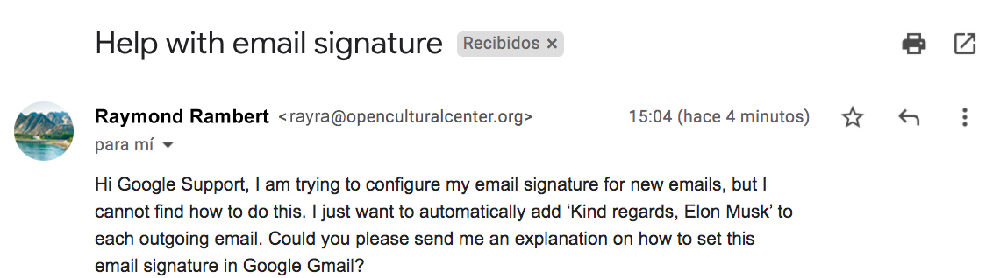

# Home assignment

### **Situation**

You have received a new technical case from a customer of Google Gmail. The customer is asking the following:

### **Assignment**

Reply to this customer like you are writing a real email back as if you already were working in Google Technical Support. Include the explanation of how to set a signature in Google Gmail, and if you can, include a link to a webpage with more information. Make sure to use a good email structure and be polite and clear to the customer. Make use of Google Search to find the required information.

Once you have written this email, you can send it in a reply to **simon@migracode.org**

### **Resolution**

We will let you know as soon as possible if you have passed this step and if you will be accepted to our course.&#x20;

Thank you in advance and let us know if you have any questions.
