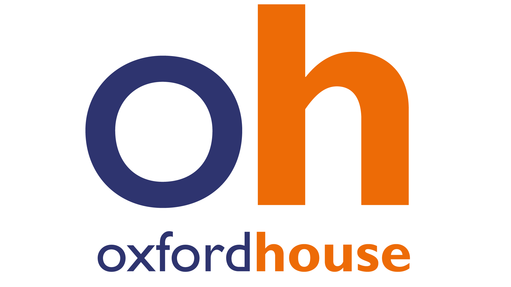

# Oxford House

## What they offer:

* Free of charge
* English classes
* A2 to B2 (no beginners, no advanced)
* Fully online (2021)
* 2 classes of 1H30mins OR 1 class of 3H every week

## How to apply?

### Step 1

Take the[ level test here](https://oxfordhousebcn.com/en/levels/level-tests/english/) and **convert it to the "Oxford House levels"** using this chart:

### Step 2

Choose the time table that suits you best on this chart:

### Step 3

**Register** on [this link](https://oxfordhousebcn.com/en/registration/online-registration-english-eco-1-free-course/).&#x20;

Here is **all the information you need** in order to register:

* The "Oxford House level" that **corresponds to your level test result**
* The **timings** that suit you best **exactly** as you see on the chart in Step 2 (not others)
* The promotional code: **MIGRACODE**
* As the start of your course, choose **the closest ideal date for you**

### **Step 4**

Wait for your **confirmation letter**, you will receive it by email.&#x20;

### **Step 5**

Using the information that you have in the confirmation letter, fill in [this confirmation form](https://airtable.com/shr29aF9pVVIZlDgG). **You will NOT be considered as registered by MigraCode** until you complete this step, and we will not be able to support you with your language learning.

